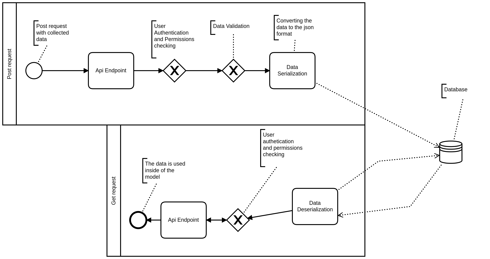
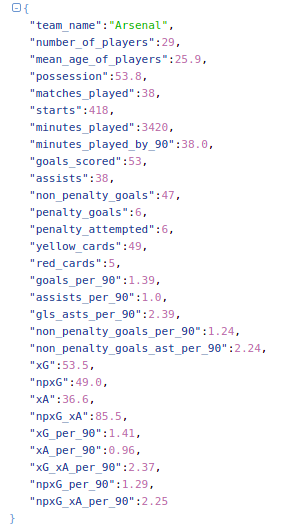
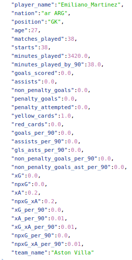

# Premier League Rest Api  

## Motivations behind this project  

I am currently working on a machine learning model that predicts the final results of Premier League football matches. In order to be able to make these predictions, the model requires statistical data on each player and each team during the matches. 
To make the data ingestion process more fluid it is almost essential to have a database and a rest api to issue queries against this database. 
This api will be part of a data pipeline which is also under development

## Objectives 
- Program a rest api to serve previously collected data from the English football championships.

##  Technologies
- Django
- Django Rest Framework 
- Postgresql

## Project structure

Below you can see the structure of the rest api. The major components will be detailled further in the readme.

## Available data
The data is scrapped on the website [Fbref.com](https://fbref.com/en/). 
For the moment it is the statistics of the 2020-21 season.  
I plan to add more types of data in the future.  
They are divided into 2 categories: 
- Seasonal statistics for a team 
- Seasonal statistics for a player
### Examples

This is what an entry looks like for a team :  

  

This is what an entry looks like for a player :  

### Data Explanation  
#### Player Season Data  
| Feature                      | Explanation                                                                                                            |
|------------------------------|------------------------------------------------------------------------------------------------------------------------|
| player_name                  | Name of the player                                                                                                     |
| nation                       | Player's nationality                                                                                                   |
| position                     | Player's position on the pitch                                                                                         |
| age                          | Player's age                                                                                                           |
| matches_played               | Total of matches played during the season                                                                              |
| starts                       | Total of matches started during the season                                                                             |
| minutes_played               | Total of minutes played during the season                                                                              |
| minutes_played_by_90         | Total of minutes played divided by 90. (The average of minutes played by game)                                         |
| goals_scored                 | Total of goals scored during the season                                                                                |
| assists                      | Total of assists performed during the season                                                                           |
| non_penalty_goals            | Total of goals scored that were not a penalty strike                                                                   |
| penalty_goals                | Total of goals scored on a penalty                                                                                     |
| penalty_attempted            | Total of penalty attempted                                                                                             |
| yellow_cards                 | Total of yellow cards awarded to the player during the season                                                          |
| red_cards                    | Total of red cards awarded to the player during the season                                                             |
| goals_per_90                 | Total goals scored by 90. (Average goals by match)                                                                     |
| assists_per_90               | Total assists by 90. (Average assists by match)                                                                        |
| gls_asts_per_90              | Total goals + assists by 90. (Average goals + assists by match)                                                        |
| non_penalty_goals_per_90     | Non-penalty goals by 90.  (Average goals that were not a penalty by match)                                             |
| non_penalty_goals_ast_per_90 | Total non-penalty goals + total assists by 90. (Averag goals that were not a penalty + assists by match)               |
| xG                           | Total expected goals on the season.                                                                                    |
| npxG                         | Total non-penalty expected goals                                                                                       |
| xA                           | Total expected assists                                                                                                 |
| npxG_xA                      | Total non-penalty expected goals + expected assists                                                                    |
| xG_per_90                    | Expected goals by 90.  (Average expected goals by match)                                                               |
| xA_per_90                    | Expected assists by 90.  (Average expected assists by match)                                                           |
| xG_xA_per_90                 | Expected goals + expected assists by 90.  (Average expected goals + assists by 90)                                     |
| npxG_per_90                  | Non-penalty expected goals by 90.  (Average non-penalty expected goals per match)                                      |
| npxG_xA_per_90               | Non-penalty expected goals + expected assists by 90. (Average non-penalty expected goals + expected assists per match) |
| team_name                    | Player's team                                                                                                          |
